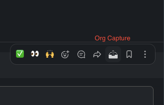

# Slack: Org Protocol Capture

Adds a button to each slack message hover menu that sends the message contents and some metadata to org capture protocol.

More details in the blog post: https://srijan.ch/capturing-slack-messages-directly-into-emacs-orgmode-inbox

# Changelog

## v1.0

Initial working version
